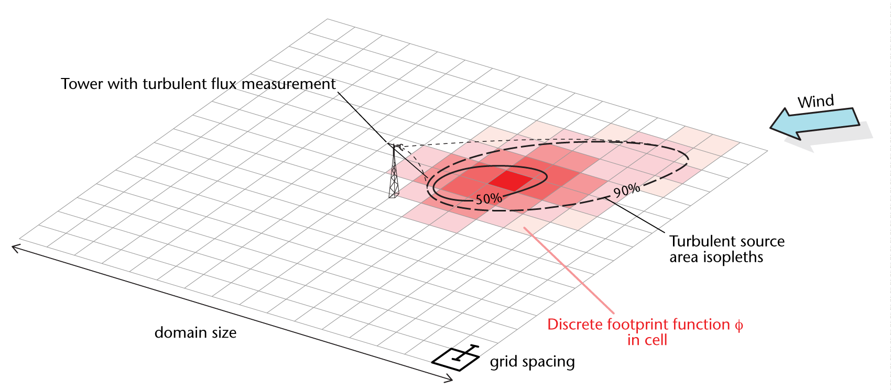
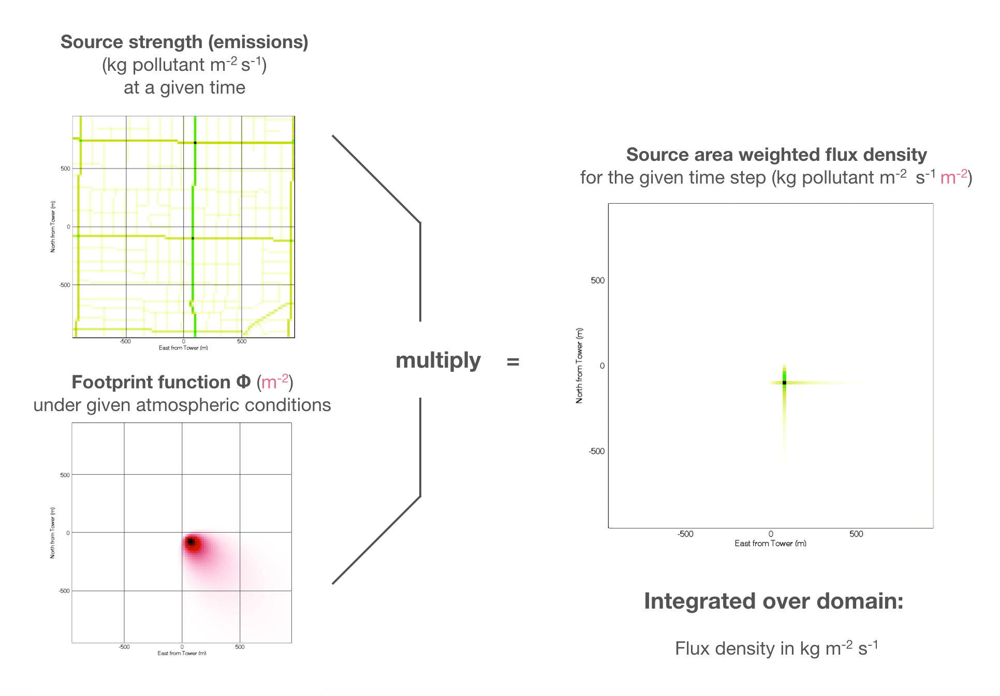

# Gridded-Turbulent-Source-Area

Purpose: Calculate and output gridded turbulent source areas following the [Kormann and Meixner (2000)](#korman). analytical source area model. 

In the case of a landscape with a homogenous distribution of sources (or sinks) at the surface, the gridded footprint function *&phi;* (x,y) shows the fraction of vertical turbulent flux originating from a cell (m^-2) representing a surface area. More generally, the grid cells show the vertical flux at the surface per unit point source (at the tower), when inverting time. 

If the actual geographical distribution of sources (and sinks) in the source area is known, then the total flux measured at the tower is the sum over the product of footprint function *&phi;* (x,y) and the grid cell's flux *F* (x,y) over all cells as illustrated here (see also [Christen et al. 2011](#christen) for an example):

Individual source areas for one time step can be merged into a cumulative source area to create a source area climatology. In a cumulative source area, for each x and y, the individual *&phi;* (x,y) from each time step are summed and divided by the number of time steps.

## Creating footprint grids from the command line

You must either have the free [IDL Virtual Machine](http://www.exelisvis.com/Support/HelpArticlesDetail/TabId/219/ArtMID/900/ArticleID/12395/The-IDL-Virtual-Machine.aspx) installed or the full development version. The following steps have been tested under UNIX / Mac. To install the (free) IDL Virtual Machine go to:

Then you can call IDL in runtime mode from the command line with the following required arguments:

      idl =rt=[Path_to_fpr_write_ncdf.sav] -args [Path_to_output_file] [z0] [zm] [u] [wd] [sig_v] [L]
 
Arguments passed via "-args" are as follows in exactly this order and separated by space
 
* [Path_to_fpr_write_ncdf.sav] is the full file path to the compiled Path-to-fpr_write_ncdf.sav file
* [Path_to_output_file] is the full file path of the netCDF file to be written
* [z0] is the rougness length (in m)
* [zm] is the height of flux system (in m) 
* [u] is the longitudinal wind velocity component (im m/s)
* [wd] wind direction (from geogr. N)
* [sig_v] is the standard deviation of lateral wind velocity (im m/s)
* [L_input] is the Obukhov length (in m)

Here is an example:

      idl -rt=/Users/Username/fpr_write_ncdf.sav -args /Users/Username/footprint.nc 0.002 25.42 3.25 320.2 0.032 294002

There are additional optional commands as follows
 
      idl =rt=[Path_to_fpr_write_ncdf.sav] -args [Path_to_output_file] [z0] [zm] [u] [wd] [sig_v] [L] [XD] [YD] [OD] [grid] [datetime] [site] [timezone] [provider]
 
* [XD] Maximum distance the model grid (in m) should extend upwind of the sensor (default 1000 m)
* [YD] Maximum distance the model grid (in m) should extend lateral away from the centreline (default 500 m).   
* [OD]: The total domain size in m for the netCDF file output, where the flux system will be in the center (i.e. domain size will be domain_output x domain_output)
* [grid] resolution of the grid-cells in m (default 5 m)
* [datetime] : double. date and time of the footprint as [julian date](https://en.wikipedia.org/wiki/Julian_day)
* [site] text. name of site / system
* [timezone] text. time zone of time information.
* [provider] text. data provider or operator of site.

Here is an expanded example

      idl -rt=/Users/Username/fpr_write_ncdf.sav -args /Users/Username/footprint.nc 0.002 25.42 3.25 320.2 0.032 294002 500 200 1000 2.0 1783049.5 Vancouver-Sunset GMT-8 UBC
      
Make sure there are no spaces in the station name or file path.
   
### Batch processing

One can write a batch file or use scripting to call the line with different arguments to process large datasets.
   
### Potential errors   
   
If you cannot run IDL from the command line, it is possible that the IDL command is not defined. In this case, you must manually set-up your IDL command first by typing into the terminal:

            echo "export PATH=/Applications/exelis/idl84/bin:$PATH" >> ~/.bashrc
            echo "source ~/.bashrc" >> ~/.bash_profile

Then log out and into your account again.

## Compiled code  

## fpr_write_ncdf.sav

This compiled code calculates the flux source area ('footprint') for one given time step in a gridded version, rotates then the output into mean wind and writes a geographcally referenced raster into a netCDF file. It can be called from the command line as discussed above.

## Source Code 

## fpr_write_ncdf.pro
 
This routine calculates the flux source area ('footprint') for one given time step in a gridded version, rotates then the output into mean wind and writes a geographcally referenced raster into a netCDF file. This code calls the subroutine fpr_kormann_and_meixner.pro described below to perform calculations.

The netCDF format is described here:
http://www.unidata.ucar.edu/software/netcdf/docs/

### required inputs:

* filename : string. path. filename of the netCDF file the footprint will be written to.
* z_0_input : float. roughness length z0 of surface (in m)
* z_m_input : float. effective measurement height of flux system (in m) i.e. zm = (z-d)
* u_input : float. measured longitudinal wind velocity component (im m/s)
* wd_input : float. wind directions in degree from geographic North.
* sig_v_input : float. measured standard deviation of lateral wind velocity (im m/s)
* L_input : float. measured Obukhov length (in m)

### optional inputs

* juliantime : double. time of the footprint as julian date
* domain_output: float. the domain size in m for the ncdf file, where the flux system will be in the center (i.e. domain size will be domain_output x domain_output)
* x_max_input : float. maximum distance the model grid should extend upwind of the sensor (default 1000 m)
* y_max_input  : float. maximum distance the model grid should extend lateral away from the centreline (default 500 m). Total domain in y-direction is 2 x y_max_input (default 1000 m)
* d_input : float. resultion of the grid-cells in m (default 5 m)
* site : string. name of site / system
* timezone : string. time zone of time information.
* provider : data provider or operator of site.

### fpr_kormann_and_meixner.pro

This routine calculates the flux source area ('footprint') for one given time step in a gridded version based on the following inputs:

required inputs: 
*   z_0_input    : float. roughness length z0 of surface (in m)
*   z_m_input    : float. effective measurement height of flux system (in m) i.e. zm = (z-d)
*   u_input      : float. measured longitudinal wind velocity component (im m/s)
*   sig_v_input  : float. measured standard deviation of lateral wind velocity (im m/s)
*   L_input      : float. measured Obukhov length (in m)
   
optional inputs:
* x_max_input  : float. maximum distance the model grid should extend upwind of the sensor (default 1000 m)
* y_max_input  : float. maximum distance the model grid should extend lateral away from the centreline (default 500 m). Total domain in  y-direction is 2 x y_max_input (default 1000 m)
* d_input      : float. resultion of the grid-cells in m (default 5 m)

The numerical solve used to find the exponents of the power laws for the wind and eddy diffusivity profiles (Eq. 39 & 40 in Kormann & Meixner) works only for a typical range of input parameters. It is possible that no solution is found for a case.

The grid is aligned into mean wind direction.

The output includes in a structure:

      PHI             DOUBLE  [nx,ny] Flux footprint or vertical flux per unit point source
      COORD           FLOAT   [nx,ny,2] Geograhical coordinates whith flux system at [0,0].
                              [nx,ny,0] are x-coordinates for each point of the grid
                              [nx,ny,1] are y-coordinates for each point of the grid
      PARAM_M         FLOAT   Exponent of the wind velocity power law
      PARAM_N         FLOAT   Exponent of the eddy diffusivity power law
      PARAM_U         DOUBLE  Constant in power-law profile of the wind velocity
      PARAM_KAPPA     DOUBLE  Constant in power-law profile of the eddy diffusivity
      PARAM_USTAR     DOUBLE  Friction velocity
      PARAM_XSI       DOUBLE  Flux length scale
   
## References

 Kormann, R, and Franz X Meixner. 2001. 'An Analytical Footprint Model for Non-Neutral Stratification.' Boundary-Layer Meteorology 99 (2): 207–24.

Christen, A, Coops NC, Crawford BC, Kellett R, Liss KN, Olchovski I, Tooke TR, van der Laan M, Voogt JA. 2011. 'Validation of Modeled Carbon-Dioxide Emissions From an Urban Neighborhood with Direct Eddy-Covariance Measurements.' Atmospheric Environment 45 (33). 6057–69. http://dx.doi.org/10.1016/j.atmosenv.2011.07.040
